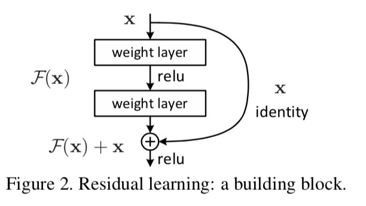
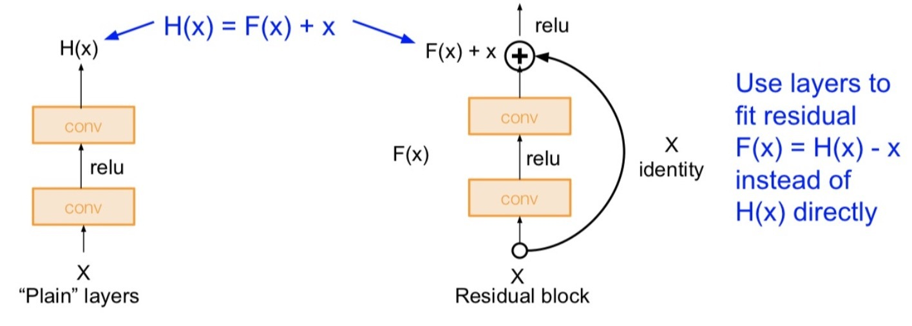
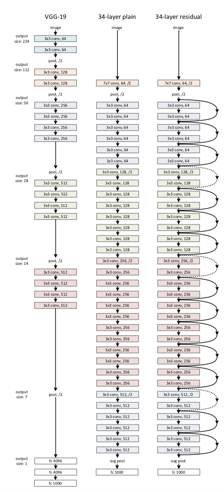
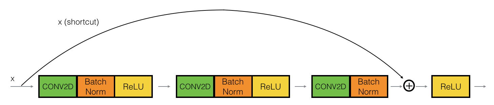
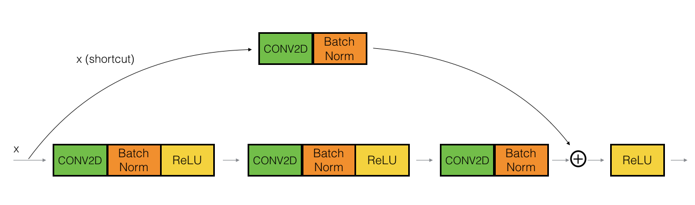
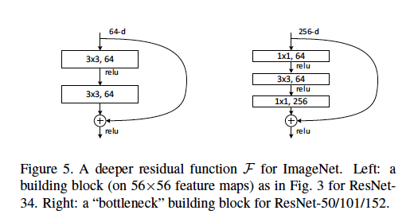

# Resnet
## Abstract
Unlike other previous CNN, ResNet uses to train residual to make easier train the deep network. Residual network is easy to optimize and better accuracy from the deep layers network. 
## Introduction
DCNN (deep convolutional neural network) led the image classification to another level significantly. From previous studies, we figured out that **depth** was very important factor that contributed the most in model accuracy. 
However, as we increased **depth** deeper, we faced to the problems such as *Gradient Vanishing/exploding*, which we called **degradation**. 

Through the residual mapping, we could solve the problem. When we called H(x) as the previous model or network, the new mapping is:
**`F(x) = H(x) - x`**
So making F(x) close to H(x) with residual mapping is easier to optimize the model. **F(x)** is the difference and **x** is input.

There is **shortcut connection ** which means skipping one or more layers. Also **shortcut connection** is *identity mapping* instead of *direct mapping*. 

## Deep Residual Learning
### Indentity Mapping by Shortcuts
Resnet uses residual learning regardless of the numbers of layers. 
`y = F(x, Wi) + x (1)`
x is input and y is output vectors. F(x, Wi) is residual mapping

Based on the mapping on figure(2), the equation is this:
`F = W2 ReLU(W1x)`
In this formulat, F and x have to be same dimension. If they are not same, we could use **linear projection** to match the  two dimensions. 

### Network Architectures

1. plain network
	1) Each layer has same output feature map and same numer of filters
	2) If the size of feature map is halved, number of filters is doubled in order to keep time-complexity
2. Residual Network
	1) Shortcut keeps identity mapping and use Zero-padding to increase the dimension. This explains why extra parameters are unneccessary.
	2) Use 1X1 Conv to match the dimension of projection shortcut.

### Identity Block and Convolution Block

### Bottleneck Architecture

What's the meaning of 1 x 1 convolution? It means almost nothing when filter is 1x1 size, but sometimes we use it in deep learning to control the numbers of filters. 

So, 1 x1 convolution means something when we say it with numbers of filters. We might think that if input and output channels are same, it doesnt mean anything but when it changes the dimension, it means a lot. When the dimension decreases, numbers of parameters also decrease and time of convolution calculation that will take also decrease significantly. But we need to think about how much we reduce the dimension because we also lose information about layers when we reduce it. 

We called bottleneck because of the shape of dimension will be like > <. First, do 1x1 convolution to decrease dimensions then do whatever calculation we need to do (for example 3 x 3 convolution) then do 1x1 convolution to go back to the same dimensions that it was before. 

