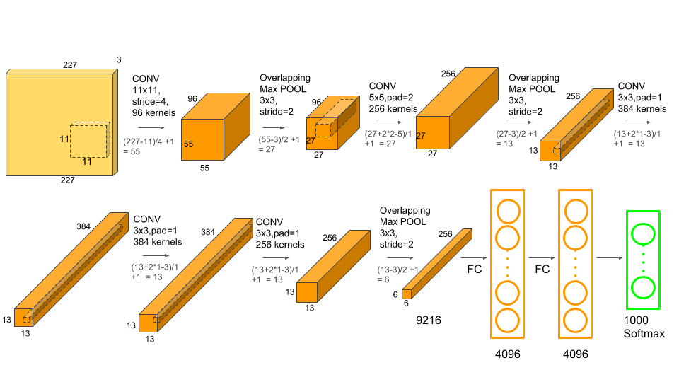

# Understanding and Calculating the number of Parameters in Convolution Neural Networks (CNNs)

Basically, the number of parameters in a given layer is the count of “learnable” (assuming such a word exists) elements for a filter aka parameters for the filter for that layer.

Parameters in general are weights that are learned during training. They are weight matrices that contribute to the model’s predictive power, changed during the back-propagation process.

Now that you know what “parameters” are, let’s dive into calculating the number of parameters in the sample image we saw above.

## CNN operation example

## Simple Nueral Network Table

1. Input layer: Input layer has nothing to learn, at it’s core, what it does is just provide the input image’s shape. So no learnable parameters here. Thus number of parameters = 0.

2. CONV layer: This is where CNN learns, so certainly we’ll have weight matrices. To calculate the learnable parameters here, all we have to do is just multiply the by the 
- shape of width m, 
- height n, 
- previous layer’s filters d and 
- account for all such filters k in the current layer. Don’t forget the bias term for each of the filter. 

    Number of parameters in a CONV layer would be : 
    
    $
    ((m \times n \times d) +1)\times k$, 
    added 1 because of the bias term for each filter. 
    
    
    Where the term “filter” refer to the number of filters in the current layer.

3. POOL layer: This has got no learnable parameters because all it does is calculate a specific number, no backprop learning involved. Thus number of parameters = 0.

4. Fully Connected Layer (FC): This certainly has learnable parameters, matter of fact, in comparison to the other layers, this category of layers has the highest number of parameters, why? because, every neuron is connected to every other neuron! So, how to calculate the number of parameters here? You probably know, it is the product of the number of neurons in the current layer c and the number of neurons on the previous layer p and as always, do not forget the bias term. Thus number of parameters here are: 

$
c \times p+1\times c$

Where 

c = Number of neurons in Current layer

p = Number of neurons in Previous layer

---------------
### The real calculation

1. The first input layer has no parameters.

2. Parameters in the second CONV1(filter shape = 5X5, stride=1) layer is: 

   $
    ((m \times n \times d) +1)\times k = ((5\times5\times3)+1)\times8 = 608$

3. The third POOL1 layer has no parameters.

4. Parameters in the fourth CONV2(filter shape =5X5, stride=1) layer is: 

   $
    ((m \times n \times d) +1)\times k = ((5\times5\times8)+1)\times516) = 3216$

5. The fifth POOL2 layer has no parameters.

6. Parameters in the Sixth FC3 layer is

    $
    c \times p+1\times c = 120\times400+1\times120 = 48120$

7. Parameters in the Seventh FC4 layer is: 

    $
    c \times p+1\times c = 84\times120+1\times84 = 10164$

8. The Eighth Softmax layer has 
    $
    c \times p+1\times c = 10\times84+1\times10 = 850$

## Note

\*\* CONV + Pooling is termed as a layer.

\*\* Just because there are no parameters in the pooling layer, it does not imply that pooling has no role in backprop. Pooling layer is responsible for passing on the values to the next and previous layers during forward and backward propagation respectively.

