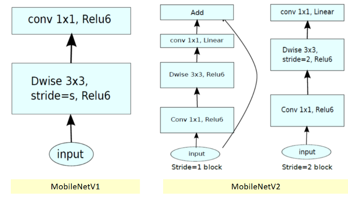
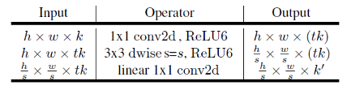
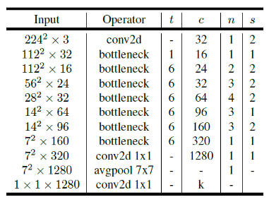
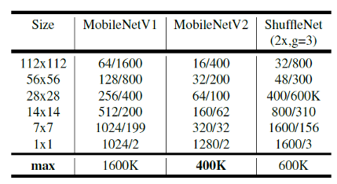
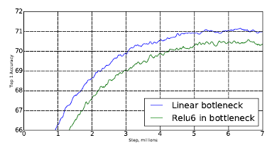
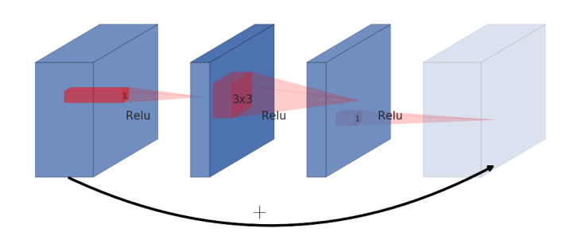
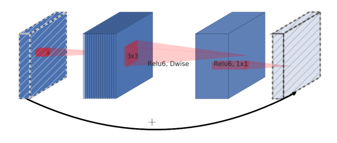
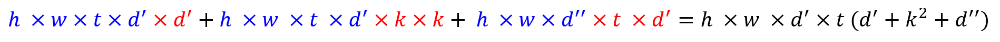
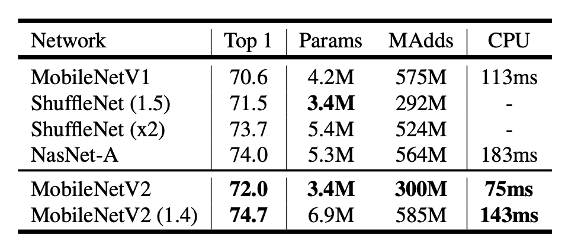

# Mobilenet V2
mobilenet v2
main feature = **Inverted Residual **

What's difference between v1 and v2?
For mobilenet v1
- v1 block  : 2 layers (1st layer: depthwise conv, 2nd layer: pointwise conv)
- activation function: ReLu6 (0 to 6)
For mobilenet v2
- v2 blocks: 2 types (residual block (stride = 1) and downsizing block (stride = 2)) and each block has 3 layers.
- both blocks's first layer = pointwise conv + ReLu6
- 2nd layer = depthwise conv (stride =1 for residual and stride =2 for downsizing).
- 3rd layer = pointise conv but no activaiton func - not applying non-linearlity
- No skip connection for downsizing block.

## Architecture

Each variables:
`t` : expansion factor, `c`: output channel, `n` : n numbers of repeat, `s` : stride.

## Linear Bottleneck
Linear transformation => linear bottleneck layer
Better than Relu

## Inverted Residual

regular residual block: wide -> narrow -> wide -> skip connection
inverted residual block: (linear bottle neck) narrow -> wide-> narrow -> skip connection  (linear bottle neck)

## Computation cost
`h x w` : input size
`t` : expansion factor
`k` : kernal size
`d'` : input channel
`d''`: output channel

Blue: output, Red: convolution filter size

## Result

