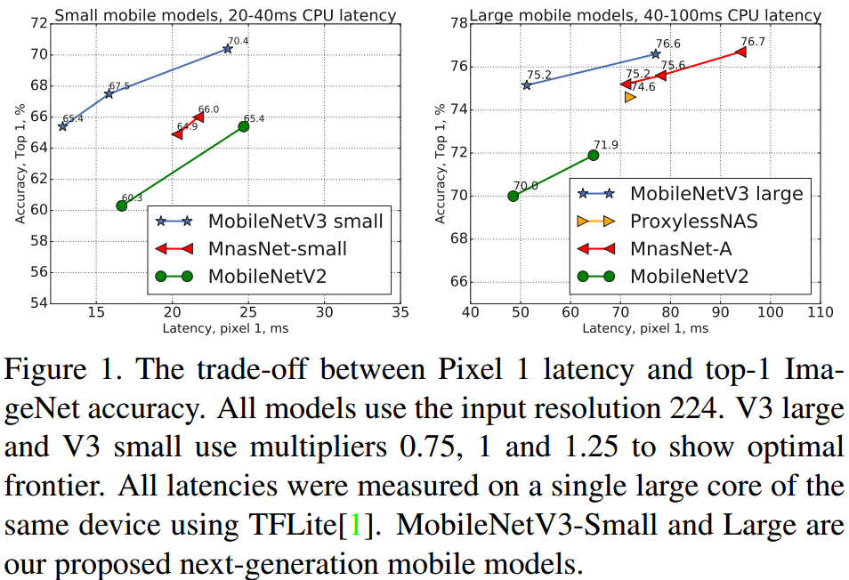
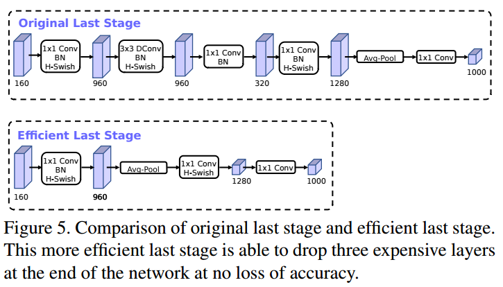
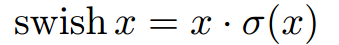
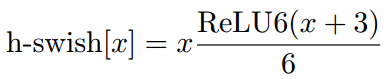
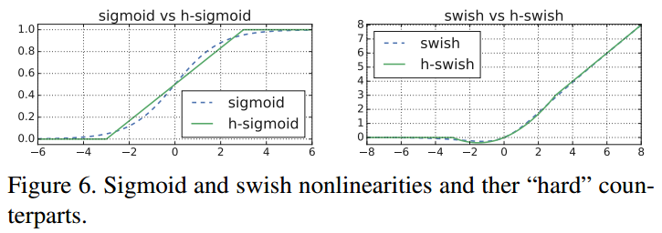
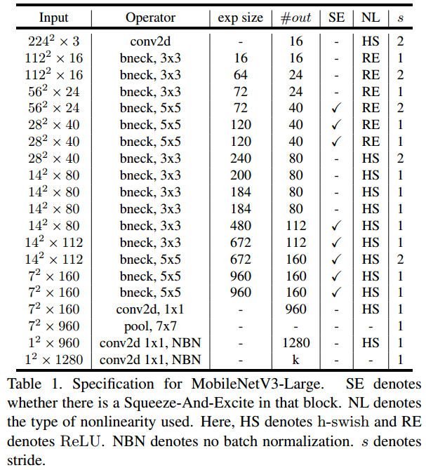
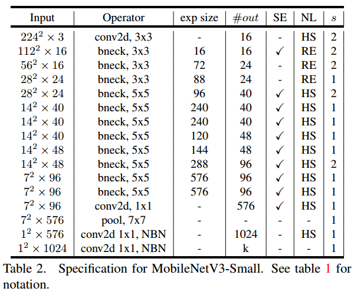
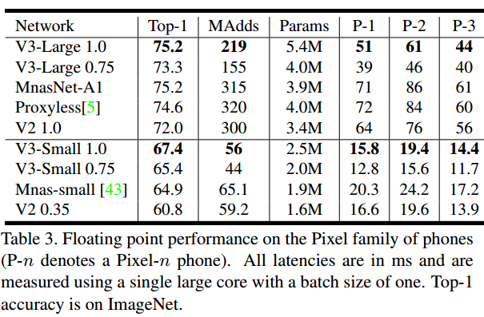
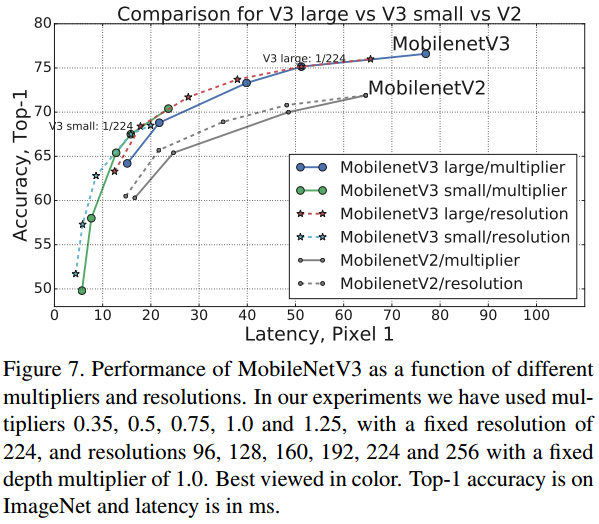

# Mobilenet V3

## Abstract

MobileNetV3 
- Optimize to mobile phone CPU 
- NAS (Network architecture search) by NetAdapt algorithm
- Two version: MobileNetV3-Large & MobileNetV3-Small (depends on high and low resource use cases)
- Compare to MobileNetV2, Large: latency 20% reduce, accuracy 3.2% improve, Small: latency same, accuracy 6.6% improve

## Efficient Mobile Building Blocks

Combination of layers as building blocks with modified **swish** nonlinearities. 

## Network Search

Network search : powerful tool for discovering and optimizing network architectures. 
MobilenetV3 uses NAS search.

### Platform-Aware NAS for Block-wise Search

### NetAdapt for Layer-wise Search

## Network Improvements

- Redesign the expensive layers at the beginning and the end of the network.
- New nonlinearity, h-swish

### Redesigning Expensive Layers

Last stage:

The final set of features from 1x1 spatial resolution instead of 7x7 spatial resolution -> reduce latency and keep high dimensional feature

Initial stage: 

32 filters in a full 3x3 conv -> 16 filters and maintain the same accuracy as 32 filters.

### Nonlinearities

**swish** improve the accuracy but cost is expensive.

- **h-swish** improve the accuracy and reduce the cost
- **h-swish** uses in deep layers - only second half of the model. 

### Large squuze-and-excite

SE block channel number = bottleneck's expansion layer * 1/4

## Architecture

## Performance

