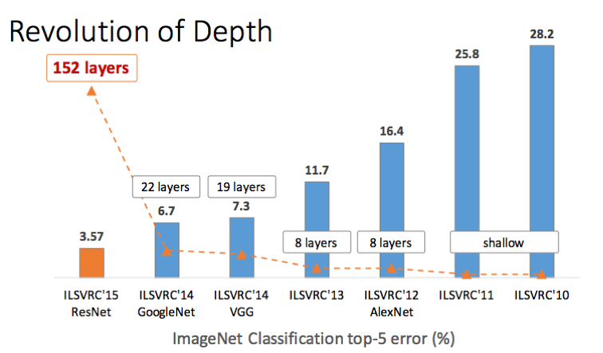

<!-- 
 -->

### Evolution history of deep CNNs

### Top 10 CNN architectures

# LeNet

### Overview

- After Convolution -> Subsampling repeated, network ended up with FCN(Fully connected layer) to perform classification
(conv -> maxpool -> conv -> maxpool -> linear -> linear)

Size description: [CxWxH]

- [1x32x32] Input
- [6x28x28] C1: creates 6 feature maps(6 channels, 28x28) by calculating with 5x5 filter(kernel_size=5)
- [6x14x14] S1: Maxpooling(Subsampling) -> it reduces the WxH size by 14x14 
- [16x10x10] C3: creates 16 feature maps by calculating with 5x5 filter 
- [16x5x5] S4: Maxpool
- [256] Reshape to 1-dim(to linear 16x16x4)
- [120] C5: creates 256 -> 120 units of (fc)fully connected layer
- [84] F6: creates 120 -> 84 fc layer
- [10] Output: create 84 -> 10 fc layer

### Network Summary
- Total params: 44,426
- Trainable params: 44,426
- Non-trainable params: 0

# AlexNet

### Overview

- AlexNet has 8 layers(5 conv layers + 3 fc layers)
- The Network has parallel structure to perform parallel operations with 2 GPUs.
- AlexNet uses input size is [3x227x227]
- Trained with ImageNet data(contains 1000 classes)

### Important things
1. ReLU activation function

- As the activation function, the ReLU function was used instead of the Tanh function used in LeNet-5. It is said to be six times faster than using Tanh while maintaining the same accuracy. After AlexNet, it is preferred to use the ReLU function as the activation function.

2. LRN(Local Response Normalization)

3. Overlapping pooling(pools 2x3 areas in units of 2 pixels and overlaps them to avoid overfitting issue)

- The role of pooling in CNN is to reduce the size of feature maps obtained through convolution. In the case of LeNet-5, average pooling was used, whereas, in AlexNet, max pooling was used. Also, in the case of LeNet-5, overlapping pooling was applied to make the stride, which is the stride length of the pooling kernel, smaller than the kernel size. Therefore, to be precise, LeNet-5 uses non-overlapping average pooling, and AlexNet uses overlapping maximum pooling.

4. Dropout(To avoid overfitting)

- Dropout was used to prevent over-fitting. Dropout refers to learning while omitting some of the neurons of the fc layer. Change the values of some neurons to 0. Therefore, the neurons have no effect on forward pass and backpropagation. Dropout is applied during training, and all neurons are used during testing.

5. Data Augmentation(Increase number of images to avoid overfitting)
    1. Randomly crop a 227x227 image from a 256x256 image
    2. change RGB channel value

To sum up AlexNet,
- [227x227x3] INPUT
- [55x55x96] CONV1: 96 11x11 filters at stride 4(+Relu)
- [27x27x96] MAX_POOL1: 3x3 filters at stride 2
- [27x27x96] NORM1: Normalization layer
- [27x27x256] CONV2: 256 5x5 filters at stride 1(+Relu)
- [13x13x256] MAX_POOL2: 3x3 filters at stride 2
- [13x13x256] NORM2: Normalization layer
- [13x13x384] CONV3: 384 3x3 filters at stride 1(+Relu)
- [13x13x384] CONV4: 384 3x3 filters at stride 1(+Relu)
- [13x13x256] CONV5: 256 3x3 filters at stride 1(+Relu)
- [6x6x256] MAX_POOL3: 3x3 filters at stride 2(+Reshape 6x6x256)
- [4096] 4096 neurons(+Relu)
- [4096] 4096 neurons(+Relu)
- [1000] 1000 neurons OUTPUT

- As a result of my personal experimentation, AlexNet had problems with data with small width and height.(Feature maps are lost as they passed through the network)

### Network Summary
- Total params: 57,584,906
- Trainable params: 57,584,906
- Non-trainable params: 0
- Total mult-adds (G): 1.01
- Input size (MB): 0.57
- Forward/backward pass size (MB): 4.86
- Params size (MB): 219.67
- Estimated Total Size (MB): 225.10

## GoogleNet

- GoogleNet has slightly better performance compare to VGGNet but VGGNet is much more simple and gives better performance with a single network. So people prefer VGGnet rather than GoogleNet.

# VGGNet

### Overview

- VGGNet is a network designed to study the effect of network depth so, the test was conducted by fixing the kernel size to one 3x3 and increasing the number of convolutions.
- Used only 3x3 kernel to reduce the number of parameters(based on experiment result, it gives faster speed and better performance)
- VGGNet network is very simple. However, it still has 122 million parameters because there are 3 fc layers at the end of network.

### VggNet Table

To sum up VggNet,

** Relu is always applied except for the layer16

- [224x224x3] INPUT
- [224x224x64] Layer1: 64 3x3x3 filters at zero padding 1, stride 1
- [224x224x64] Layer2: 64 3x3x64 filters at zero padding 1, feature map is reduced to 112x112x64 by applying 2x2 max pooling to stride 2.
- [112x112x128] Layer3: 128 3x3x64 filter.
- [112x112x128] Layer4: 3x3x128 filter. Then apply 2x2 max pooling as stride 2.
- [56x56x256] Layer5: 3x3x128 filter.
- [56x56x256] Layer6: Convolves the feature map with 256 3x3x256 filter.
- [56x56x256] Layer7: Convolves the feature map with 256 3x3x256 filter. Then apply 2 x 2 max pooling as stride 2. The size of the feature map has been reduced to 28x28x256.
- [28x28x512] Layer8 : 3x3x256 filter.
- [28x28x512] Layer9: 3x3x512 filter.
- [28x28x512] Layer10: 3x3x512 filter. Then apply 2 x 2 max pooling as stride 2. The size of the feature map is reduced to 14x14x512.
- [14x14x512] Layer11: 3x3x512 filter kernels.
- [14x14x512] Layer12: 3x3x512 filter kernels.
- [14x14x512] Layer13: 3x3x512 filter kernels. Then apply 2 x 2 max pooling as stride 2. The size of the feature map is reduced to 7x7x512.
- [7x7x512=25088] Layer14 (fc1): Flatten(Reshape) the 7x7x512 feature map. Dropout is applied during training.
- [4096] Layer15 (fc2): It consists of 4096 neurons. It is fully connected to 4096 neurons in the fc1 layer. Dropout is applied during training.
- [1000] Layer16 (fc3): Consists of 1000 neurons. Fully connected to 4096 neurons in the fc2 layer. The outputs are activated with the softmax function.

### VGGNet experiment result

- As the network deeper, the error rate decreases(better performance). However, when we compare D, and E, we can see the performance stops improving or gets worse. So we conclude that a deeper network does not always give a better result.
- The answer to the reason is  that as network gets deeper, it causes gradient vanishing/exploding or degration.

# Ways to improve the performance of CNNs

### Depth

# ResNet

### Overview

- The ResNet author experimented to see what happens when the network gets deeper. They conducted a comparative test between 20-layer and 56-layer and found that 56-layer had worse results
- ResNet authors tried to highlight the side effects of gradient vanishing/exploding or degradation when the network is deepened.

