# [Object Detection] Single Shot MultiBox Detector: SSD

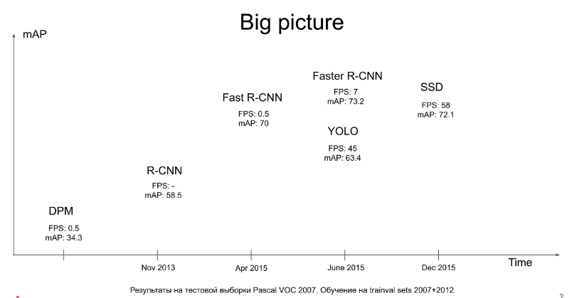

## Table of Contents

- [`Abstract`](#Abstract)
- [`Overview`](#Overview)
- [`Preview`](#preview)
- [`Model`](#Model)
- [`Model Summary`](#ModelSummary)
- [`Training`](#Training)
- [`Dataset`](#Dataset)
- [`Loss function`](#LossFunction)
- [`Result`](#Result)

## Abstract
SSD discretizes the ouput space of bouding boxes into a set of default boxes over different aspect ratios and scales per feature map location (mulitple feature map)

## Overview

RCNN, 2-stage detector, provides high accuracy in various models but detection time is slow. On the other hand, YOLO v1, 1-stage detector, provides very fast detection time but the accuracy is not good because it only selects two bounding boxes for each grid cell. However, SSD has both high accuracy with fairly fast detection time.

## Preview
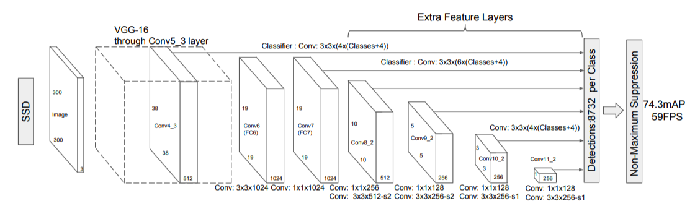
- SSD model uses **VGG16** as base network and auxiliary network.
- fc layer -> Conv layer to connect two network to improve detection speed
- Use **total 6 different scale of feature map** to predict
- Each feature map has **default box** which is different scale and aspect ratio of bounding box for each cell

## Model

### Multiscale feature maps

SSD model use VGG16 as backbone and auxiliary network after. SSD model connects two network with conv layer. 

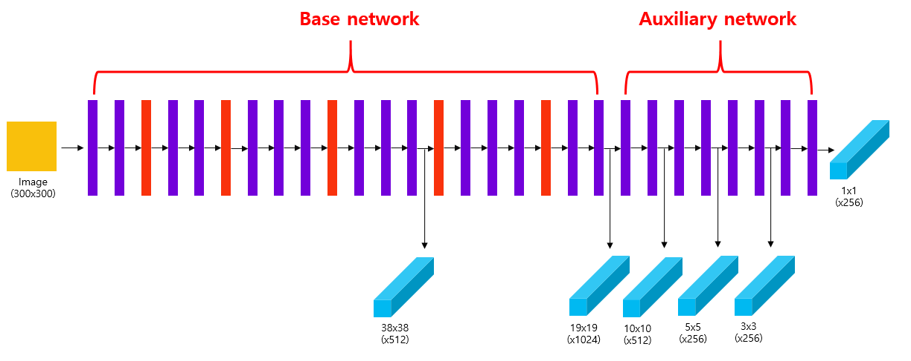

The main idea of SSD model is using **various scale of feature maps**. YOLO v1 only uses 7 x 7 feature map. One scale feature map cause difficulties to detect objects in various sizes. 

Based on the picture above, 
- input image : 300 x 300
- 1st feature map (38 x 38) from base network conv4_1 layer
- 2nd feature map (19 x 19) from base network conv7 layer
- 3rd feature map (10 x 10) from auxiliary network conv8_2 layer
- 4th feature map (5 x 5) from auxiliary network conv9_2 layer
- 5th feature map (3 x 3) from auxiliary network conv10_2 layer
- 6th feature map (1 x 1) from auxiliary network conv11_2 layer

### Default Boxes

Generate **default box** with differnet scale and aspect ratio in feature map for each cell. Default box is conceptually similar to anchor box but there is a difference between which is default box applies to different size of feature maps. 

Therefore, SSD model generate default boxes for total 6 scale feature map (38x38, 19x19, 10x10, 5x5, 3x3, 1x1) of each cell.

Default box scale = , where the ratio to the input size.

The equation is:

,&space;k&space;\in&space;[1,m])

-  = 0.2

-  = 0.9
- m : numbers of feature maps (SSD = 6)

Aspect ratio: 

Default box width and height:

)

If aspect ratio 1:1, the additional default box is added:

First feature map (38 x38) has default box scale as 0.2. Second one has 0.34. And last one (1x1) has 0.9. Therefore, smaller feature map scale is bigger the default box scale.

Then, find feature map center points:

,&space;i,j&space;\in&space;[0,&space;|f_k|])

,where fk is feature map size 

Then multiply these center points with actual image size and draw default box for each center points. 

More detail demonstration can be found here: [GitHub](https://github.com/yeomko22/ssd_defaultbox_generator)

### Predictions

First feature map and last feature map have 4 default box and rest have 6 default box.

**output feature map channel number = k(4+c)**

where, k = number of default box, c = number of class

### ModelSummary

#### Steps:

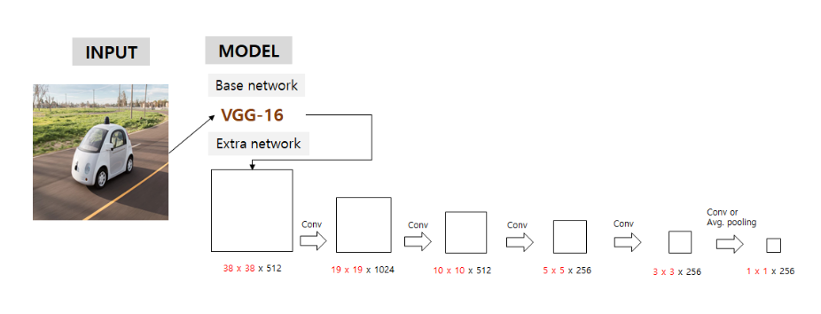
Step 1: Six multi feature maps are generated. (38x38, 19x19, 10x10, 3x3, 1x1) -> Output

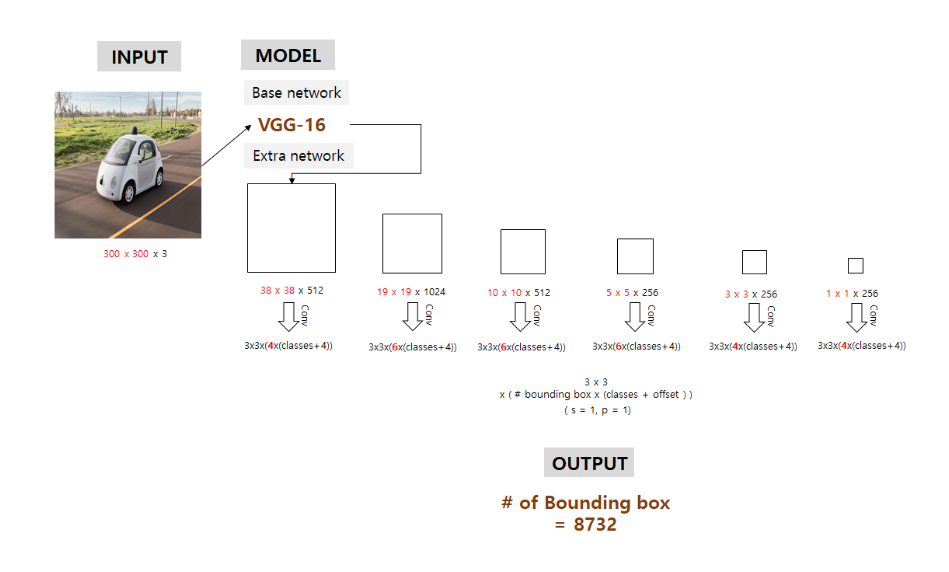
Step 2: 

conv filter size = 3 x 3 (# of bounding box x (class score + offset))

Total bounding box = 8732

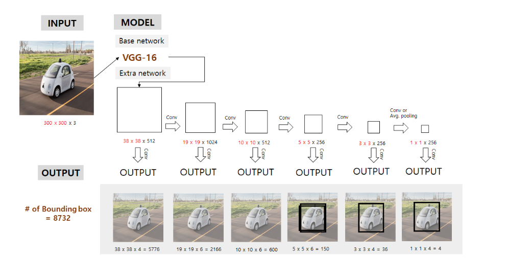

Step 3: SSD model does not use all 8732 bounding box output. Calculate IOU among default boxes and only IOU >= 0.5 boxes can be detected. 

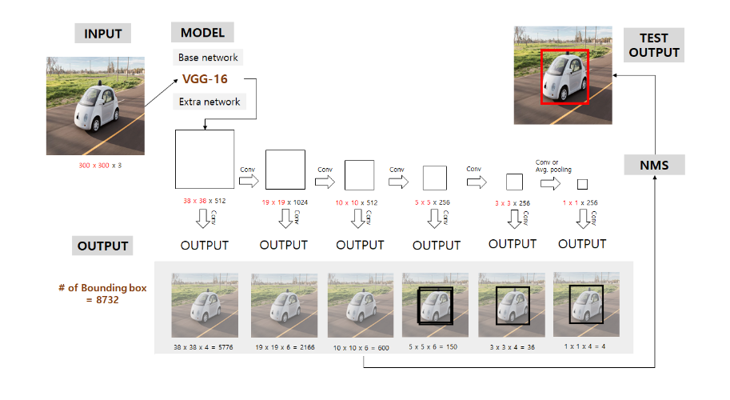

Step 4: use NMS to detect final result. 

## Training

### Dataset

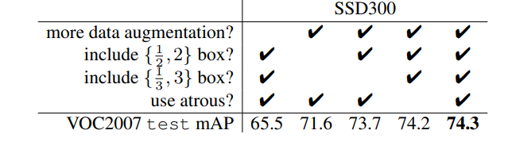
This shows that data augmentation affects huge on performance (8.8 mAP) - VERY Important.

#### Data Augmentation
- Randomly sample patch [0.1, 1]
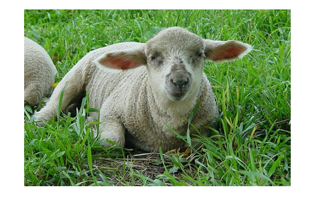
w, h from image and times random number between 0.1 and 1 (paper uses [0.3,1])

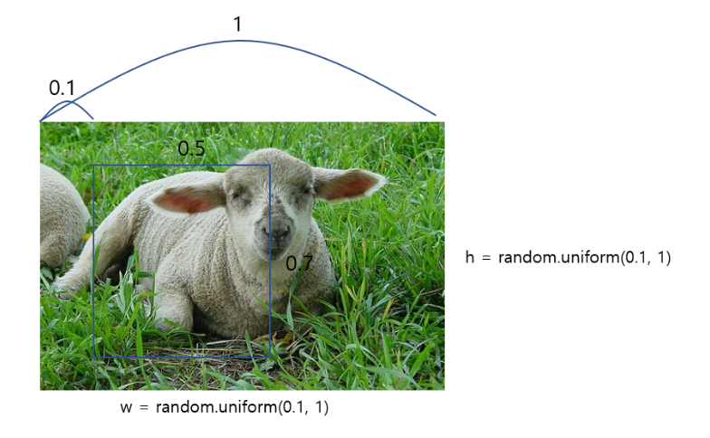
For example, sampling w = 0.5 h = 0.7. 

This patch must have aspect ratio between 0.5 < p < 2. 

Above example, p = 0.5/0.7 so it is in the range.

- Sample a patch so that min jaccard overlap with the object is 0.1, 0.3, 0.5, 0.7, 0.9
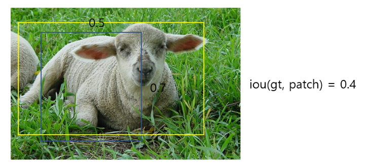

jaccard overlap between a patch and gt (yellow) has to be bigger than randomly selected value between [.1, .3, .5, .7, .9]. For example, iou (gt, patch) = 0.4. When IOU value is selected either .1 and .3 < 0.4, use it as data, otherwise re-patch sampling 

- horizontally fliped witha probability of 0.5

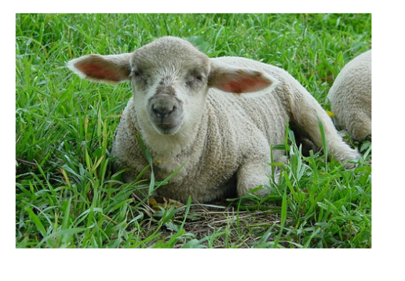

- zoom in
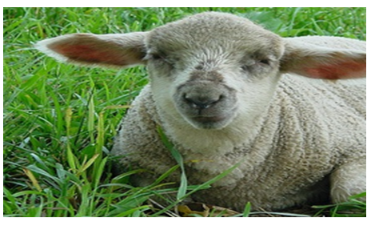

- zoom out
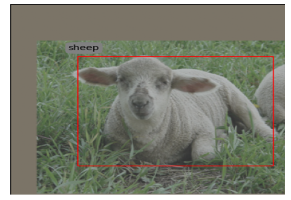

Here is more detail blog : [Data Augmentation in SSD](https://www.telesens.co/2018/06/28/data-augmentation-in-ssd/)

### Terms:
**Ground Truth Box** 

**Predicted Box**: grid cell x grid cell x (# of bounding box x (class + offset))

**Default Box**: 6 per cell

First, find IOU between default box and ground truth box and set 1 if IOU >= 0.5 else 0. 

### Lossfunction

=&space;\frac{1}{N}(L_{conf}(x,c)&plus;\alpha&space;L_{loc}(x,l,g)))

SSD model's loss function is addition of two loss, confidence loss  and localization loss .  is balancing parameter (weight) and default is 1. **N** is number of default box that is matching with ground truth box.

#### Local Loss
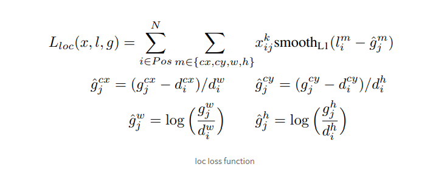
Use smooth L1 loss to (cx, cy, w, h) of  every positive default box that match with gt

#### Confidence loss
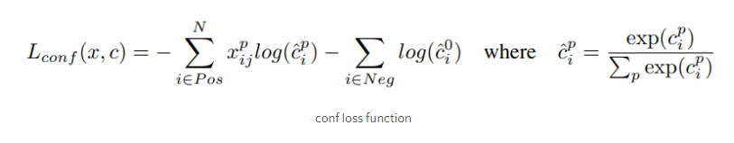
The first term of the loss is to use cross-entropy to postive default box that satisfy matching strategy. The second term is to use cross-entropy to hard negative mining (pick higher features of negative default box after softmax)

### Hard negative mining

negative : positive = 3: 1 since default boxes are mostly negative (background). 3 to 1 is optimal.

## Result

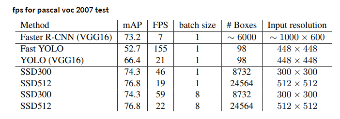

### Writer: **K.W. Hong** *(kh4vv@virginia.edu)* 
[][linkedin]
[][instagram]
[][github]

[instagram]:https://instagram.com/hongs_uva
[linkedin]:https://linkedin.com/in/hongs-uva
[github]:https://github.com/kh4vv