# [Object Detection] YOLO9000: Better, Faster, Stronger

[YOLO9000: Better, Faster, Stronger](https://arxiv.org/pdf/1612.08242.pdf)

## Table of Contents

- [`Abstract`](#Abstract)
- [`Overview`](#Overview)
- [`Better`](#Better)
- [`Faster`](#Faster)
- [`Stronger`](#Stronger)
- [`Result`](#Result)

## Abstract
The paper intrudoce YOLO 9000 a state-of-the-art, real-time object detection system that can detect over 9000 object categories.

---------------------------------

## Overview
- Error analysis of YOLO compared to Fast R-CNN shows that YOLO makes a significant number of localization errors.
- YOLOv1 has relatively low recall compared to region proposal-based methods(2-stage detectors such as R-CNN)
- Therefore focus mainly on improving recall, and localization while maintain classification accuracy.
- And still FAST!

---------------------------------

## Better

YOLO v1 has two shortcomings.
- Low recall compared to the Region Proposal based models
- Significant localization error

So What is YOLO9000's solution?

1. Batch Normalization

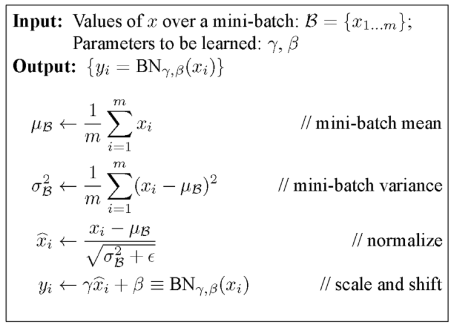

- Remove Dropout Layer from the existing model and apply Batch normalization to CNN's convolution layer that constitutes YOLO. This increases mAP by 2%.

2. High Resolution Classifier
- The existing YOLO model was configured to bring a VGG model trained with a resolution of $224 \times 224$ and then perform object detection on an image of $448 \times 448$, so the resolution was not accurate. It was solved by fine-tuning the image classification model for large resolution images before learning Object Detection, and mAP increased by 4%.
* ie) VGG input size is $224 \times 224$

3. Convolutional With Anchor Boxes

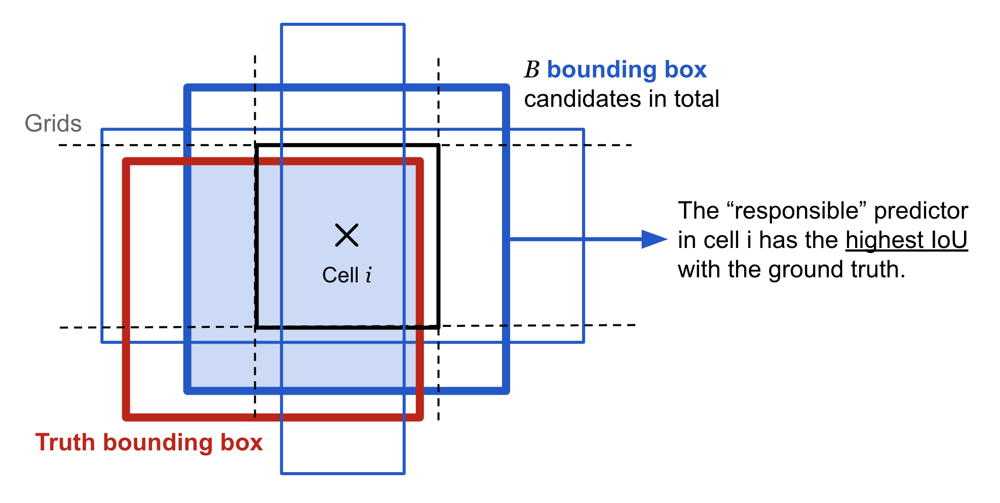

** anchor box example 1

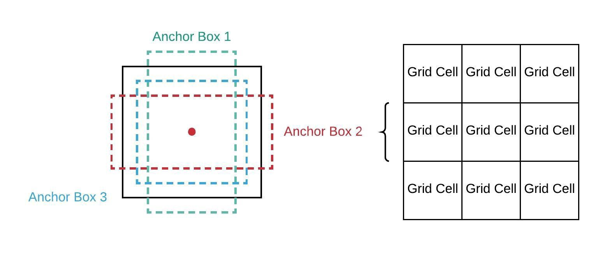

** anchor box example 2

- Removed the fully connected layer from the existing YOLO and predict in the form of a fully convolutional network.
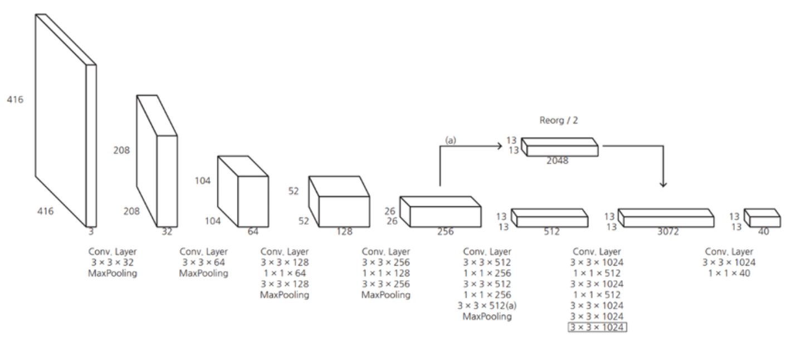

- When performing actual Object Detection, the model does not predict on the image of $448 \times 448$ resolution but predicts objects after preprocessing to have $416 \times 416$ resolution.
- So... Why resize input image by $416 \times 416$?
    - In the case of large objects, there is a tendency to be at the center of the image, and in the case of the YOLO v2 model, a model with an architecture similar to that of VGG-19 called Darknet 19 is used, and $5 \times 2$ max pooling is performed to reduce the resolution to 1/32.
    - In this case, passing the $448 \times 448$ resolution image through the YOLO v2 model creates a $14 \times 14$ resolution feature map, resulting in four grids responsible for the object located in the center of the image.
    - Thus, passing the $416 \times 416$ resolution image through the YOLO v2 model creates a $13 \times 13$ resolution feature map, making it effective that there is one grid responsible for the object located in the center of the image.
- In the existing YOLO v1 model, the class of the object was predicted for each grid (grid-based), but in the YOLO v2 model, the class is predicted for each anchor box allocated for each grid (anchor box-based).
    - When using five anchor boxes for a PASCAL VOC dataset with 20 classes of an object, 125 $1 \times 1$ convolution filters are required because each anchor box must be calculated up to a class probability, offset, and confidence score. 
- On an anchor box basis, mAP drops slightly (69.5 $\rightarrow$ 69.2) from a grid-based basis, but recall rises (81 $\rightarrow$ 88).
* ie) In the paper, anchors are also called priors.

4. Dimension Cluster

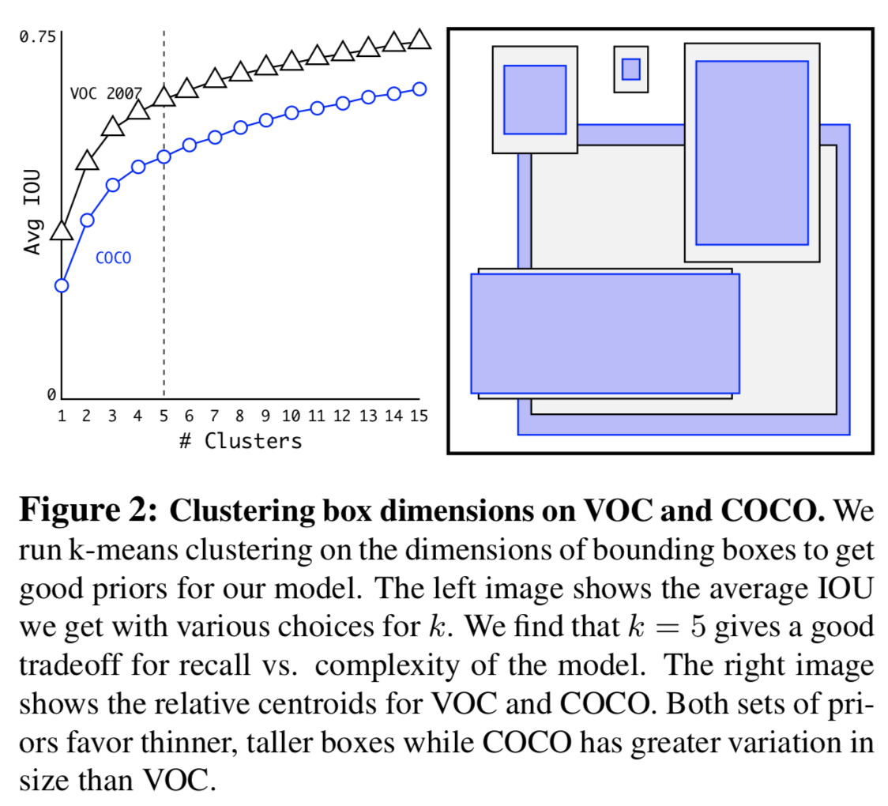

- Way to generate anchor box is different from a pre-selected anchor box-like Faster-RCNN, in this paper, select an anchor box based on data.
    - Determining the anchor box through k-means clustering between ground-truth boxes existing in detection data.
    - Since it clusters the form of the ground-truth box, clustering using the distance measure below while matching the center coordinates of the ground-truth box.
$$d(box, centroid)=1-IOU(box, centroid)$$
- As an experiment result of selecting an anchor box based on the detection dataset, the performance was good when there are 5 anchor boxes.

5. Direct Location Prediction

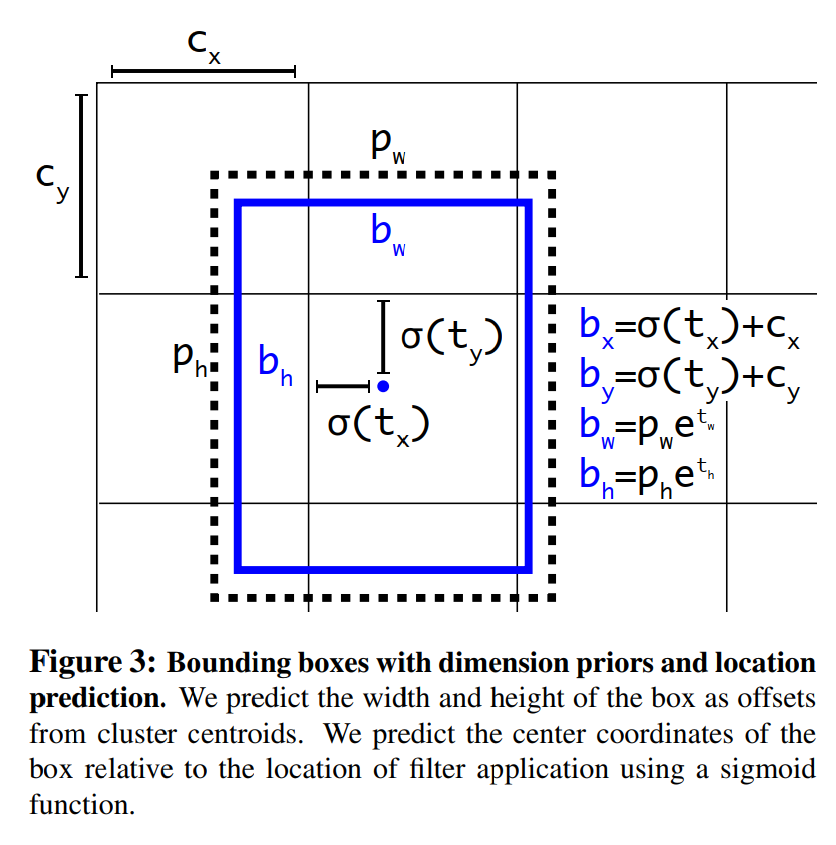

- The blue box below is the predicted boundary box and the dotted rectangle is the anchor.
- With the use of k-means clustering (dimension clusters) and the improvement mentioned in this section, mAP increases 5%.
- Based on YOLO 9000 architecture, Because of the use of an anchor box, instability occurs, especially in the early stages of training.
- Why?
    $$x = (t_x * w_a) - x_a$$ 
    $$y = (t_y * h_a) - y_a$$
    - This formulation is unconstrained so any anchor box can end up at any point in the image, regardless of what location predicted the box.
- How to solve?
    - Because of the above problem, in the YOLO v2 model, only the center coordinates follow the method of the YOLO v1 model which directly predicting the center coordinates.
    $$b_x = \sigma(t_x) + c_x$$ 
    $$b_y = \sigma(t_y) + c_y$$ 
    $$b_w = p_we^{t_w}$$ 
    $$b_h = p_he^{t_h}$$ 
    $$Pr(object) * IOU(b, object)=\sigma(t_o)$$

    where 
    $$t_x, t_y, t_w, t_h\text{ are predictions made by YOLO}$$
    $$c_x, c_y\text{ is the top left coner of the grid cell of the anchor}$$
    $$p_w, p_h,\text{ are the width and height of the anchor}$$
    $$c_x, c_y, p_w, p_h\text{ are normalized by the image width and height}$$
    $$b_x, b_y, b_w, b_h\text{ are the predicted boundary box}$$
    $$\sigma(t_o)\text{ is the box confidence score}$$

6. Fine-Grained Features
    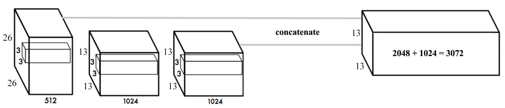
    - Convolution layers decrease the spatial dimension gradually. As the corresponding resolution decreases, it is harder to detect small objects. So each layer specializes at a different scale. YOLO adopts a different approach called passthrough. It reshapes the $26 \times 26 \times 512$ layer to $13 \times 13 \times 2048$. Then it concatenates with the original $13 \times 13 \times 1024$ output layer. Now we apply convolution filters on the new $13 \times 13 \times 3072$ layer to make predictions.

7. Multi-Scale Training
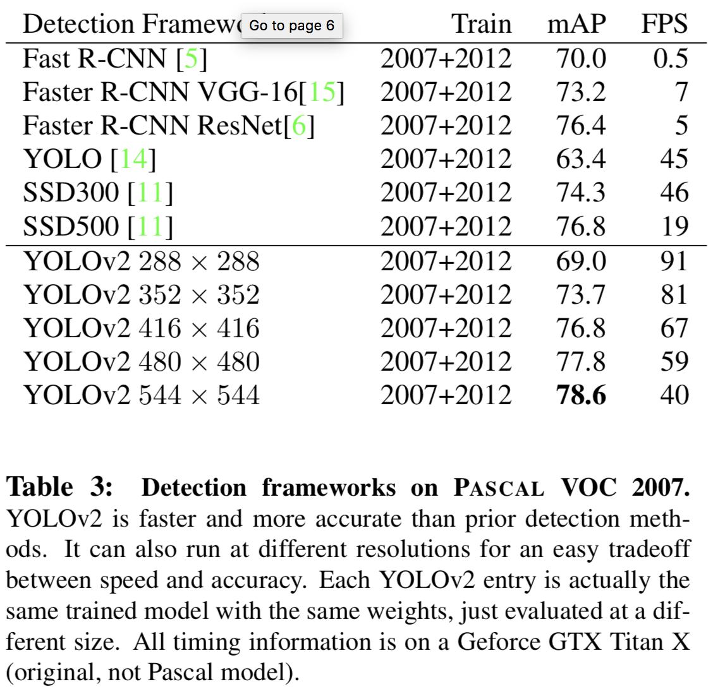

- After removing the fully connected layers, YOLO can take images of different sizes. If the width and height are doubled, we are just making 4x output grid cells and therefore 4x predictions. Since the YOLO network downsamples the input by 32, we just need to make sure the width and height is a multiple of 32. 
- ex) During training, YOLO takes images of size 320×320, 352×352, … and 608×608 (with a step of 32).
- For every 10 batches, YOLOv2 randomly selects another image size to train the model.
- This acts as data augmentation and forces the network to predict well for different input image dimension and scale.

## Faster
- The backbone of YOLO v1 is a model based on Googlenet, which has fewer operations than VGG-16, but slightly lower performance. To improve this, we propose a new architecture called Darknet-19 and use it for Object Detection.

** ie) VGG16 requires 30.69 billion floating point operations for a single pass over a 224 × 224 image versus 8.52 billion operations for a customized GoogLeNet.

1. Darknet-19
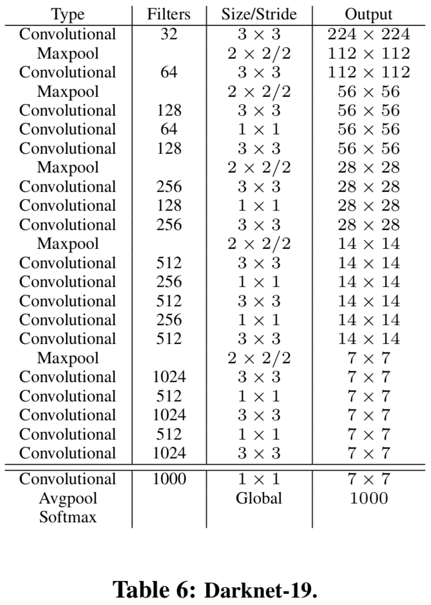
- Darknet-19 only requires 5.58 bilion operations to process an image yet achieves 72.9% top-1 accuracy and 91.2% top-5 accuracy on ImageNet. 

2. Training method

- for classification(DarkNet)
    - ImageNet 1000 classes for 160 epochs
    - Standard data augmentation : random crops, rotations, hue, saturation, and exposure shifts
    - Initial training : $224 \times 224 \rightarrow 448 \times 448$ fine-tuning for 10 epochs

- for detection
    - Adding $3 \times 3$ conv layers with 1024 filters each followed by a final $1 \times 1$ conv layer
    - For VOC, predicting 5 boxes with 5 coordinates each and 20 classes per box, so 125 filters
    - 160 epochs with a start learning rate of $10^{-3}$ dividing it by 10 at 60 and 90 epochs

## Stronger

1. Dataset combination with WordTree
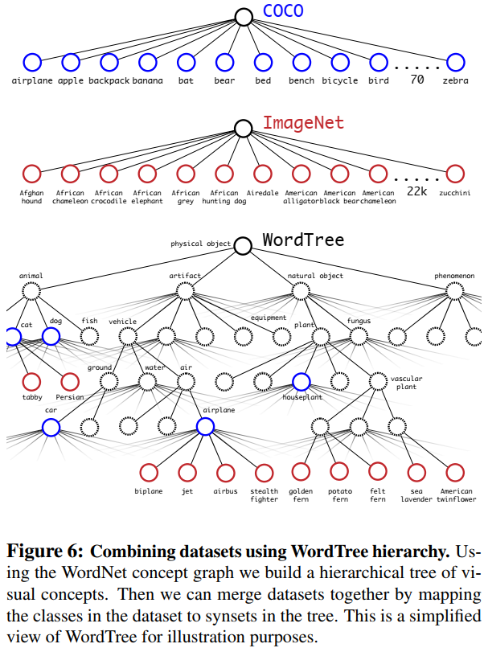

- Detection datasets have only common objects and general labels, like "dog" or "boat".
- Classification datasets have a much wider and deeper range of labels. ImageNet has more than a hundred breeds of dog, including "Norfolk terrier", "Yorkshire terrier", and "Bedlington terrier".

2. Hierarchical classification
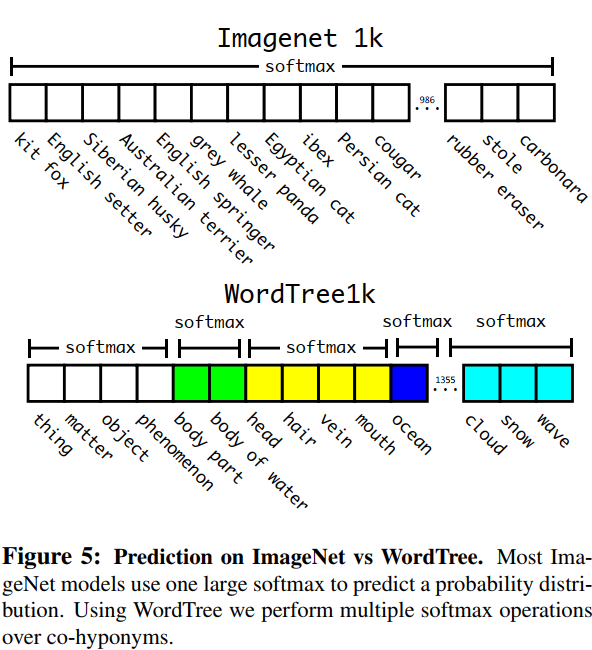

- So the paper proposes way to create word tree.(I will not explain the mothod but it is just good to know wordtree is created based on the conditional probability)

$$Pr(Norfolk \ terrier)= Pr(Norfolk \ terrier \ | \ terrier) \times$$ 
$$Pr(terrier \ | \ hunting \ dog) \ \times \ ... \ \times$$ 
$$Pr(mammal \ | \ animal) \ \times \ Pr(animal \ | \ physical \ object)$$

- WordTree to combine the labels from ImageNet and COCO. WordNet is extremely diverse so we can use this technique with most datasets.

3. Joint classification and detection
- combine datasets using WordTree we can train their joint model on classification and detection. They want to train an extremely large scale detector so they create their combined dataset using the COCO detection dataset and the top 9000 classes from the full ImageNet release.

## Result
- Quick review on difference between YOLO v1 and YOLO v2(YOLO 9000)
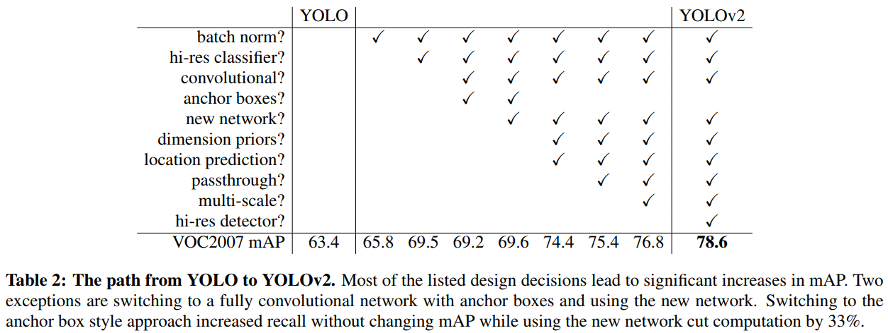

- PASCAL VOC2012 test detection result
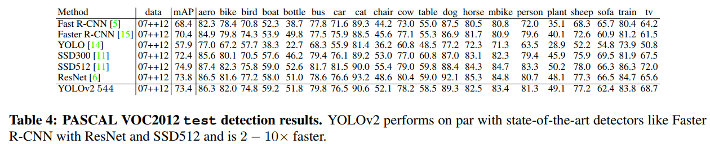
