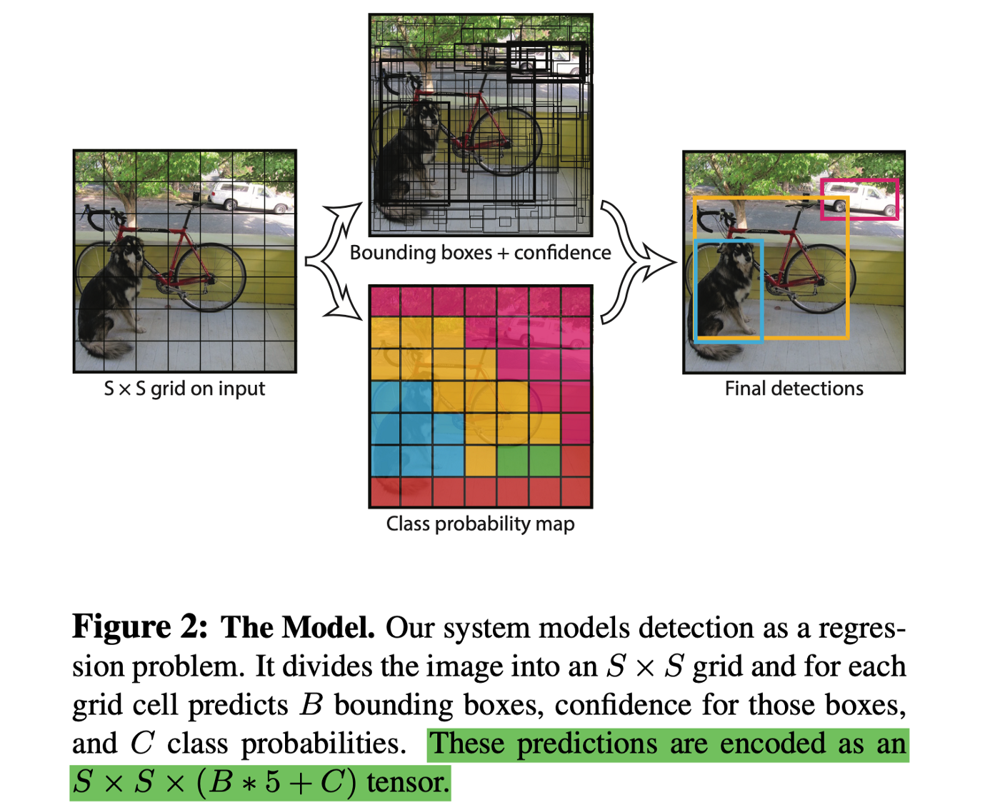
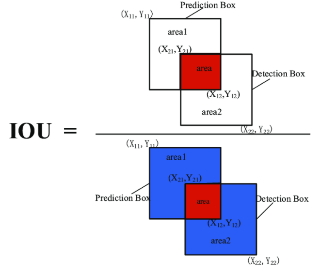
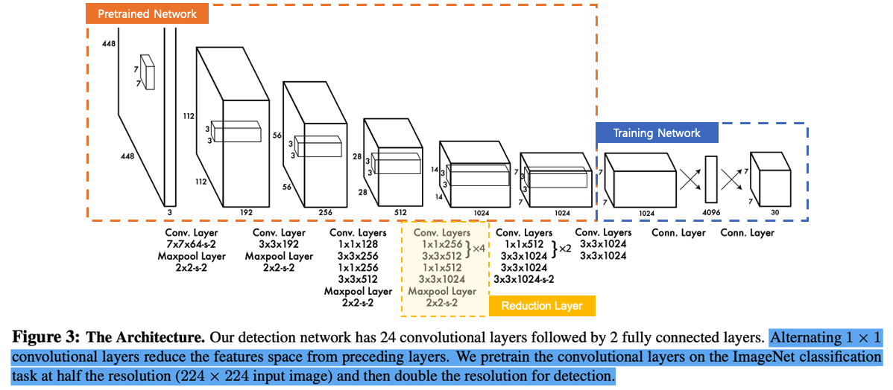
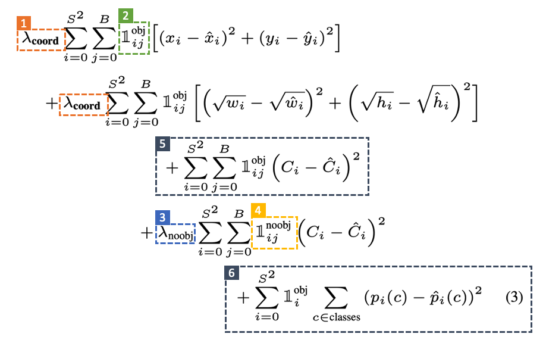
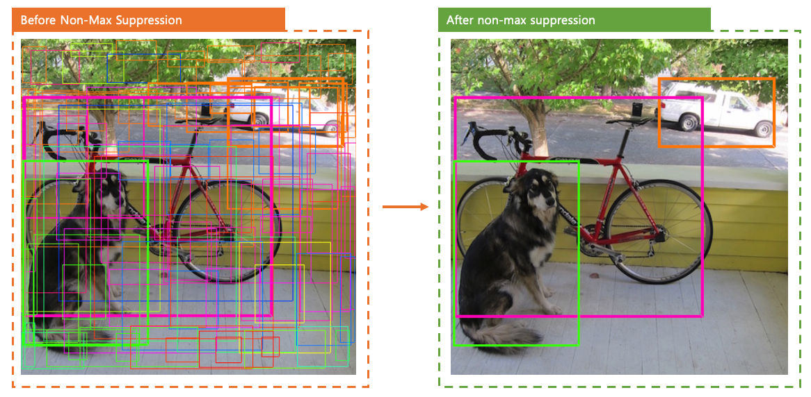

Slide Link:
https://docs.google.com/presentation/d/1aeRvtKG21KHdD5lg6Hgyhx5rPq_ZOsGjG5rJ1HP7BbA/pub?start=false&loop=false&delayms=3000&slide=id.p

---

Default: 
(S X S X (B * 5 + C))
(7 X 7) X (2 * 5 + 20)

---

C = Pr(Class_i|Object)
 = Conditional probability of C where the object exist(Which is not object)

Pr(Class_i |Object) * Pr(Object) * IOU = Pr(Class_i) * IOU

---

THe Pretrained Network is DarkNet

---

S: denotes the size of the grid cell. Since it is a matrix, the total number of grid cells becomes S².
B: denotes the bounding box of the S_i cell.
x, y, w, h: means the coordinates and size of the bounding box.
C: It is the same as the class that each grid cell is distinguished from.
Orange No. 1 symbol: A λ_coord variable set to 5 and used to give a 5 times higher penalty to localization errors. For example, in frame 5, the error according to classification does not have a weight, whereas the error in the bounding box is given a 5 times higher penalty.
Yellow green symbol #2: I was a little embarrassed because it was the first symbol I saw, but it plays the same role as the if statement. It is used in the sense that only the j-th bounding box of the i-th cell is to be learned, but the bounding box learning does not occur for all cells, and a penalty is imposed only for the bounding box with the highest IOU for each object to induce better learning.
Blue symbol #3: If there is no object in the cell, that is, in the case of the background, multiply the weight by 0.5 so as not to affect the learning of the bounding box to lower the penalty.
Yellow symbol #4: In the opposite case to sign #2, it means that it is executed when there is no object in the i-th cell and j-th bounding box.
Blue symbol #6: This is the error for classifying each cell regardless of the bounding box.

---

Inference step: After train the network based on the loss function above, it creates a lot of predicted bboxes per each cell.
Among many of those bboxes, since the cell at the center of the object usually corresponds to the 2 in Loss Function, the bounding box drawn around the center of the object has a higher Confidence Score, and the bounding box made by a cell far from the center of the object is The score comes out small.

---
Finally, objects in the image can be detected through a non-max suppression process that remove(based on low confidence score) redundant bounding boxes.

---

